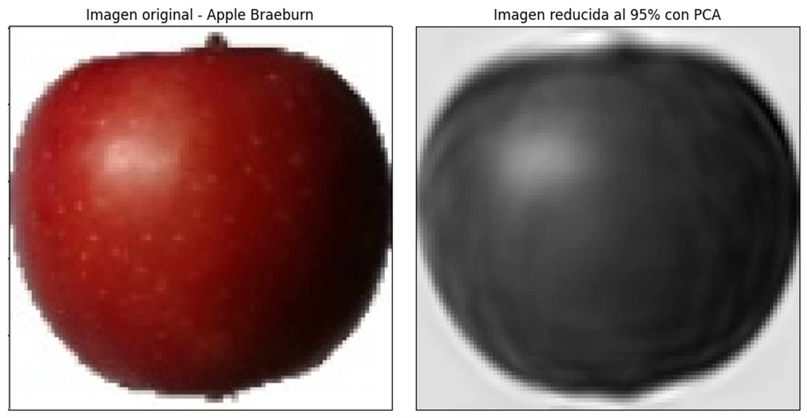

## 🛠️ Tools and Technologies Used

 
 
 

## 🌟 Project Overview

This project leverages dimensionality reduction techniques to classify fruit images from the Fruits-360 dataset, reducing dimensions from 30,000 (100x100x3) to just 188 while maintaining high accuracy. 

## 🧠 Algorithms Used

| **Algorithm**                  | **Description**                                                                                         |
|--------------------------------|---------------------------------------------------------------------------------------------------------|
| **Isolation Forest**           | Anomaly detection to identify outliers and improve model robustness.                                    |
| **K-Nearest Neighbors (KNN)**  | Used for its simplicity and effectiveness in classification tasks.                                      |
| **Support Vector Machine (SVM)** | Chosen for its ability to handle high-dimensional spaces effectively.                                  |
| **Multilayer Perceptron (MLP)** | Implemented for its deep learning capabilities, providing flexibility and precision.                   |
| **Hard Voting**                | Ensemble method that aggregates model predictions for improved accuracy.                               |
| **Soft Voting**                | Ensemble method that uses probability weights to refine predictions.                                   |
| **Principal Component Analysis (PCA)** | Dimensionality reduction technique to reduce features while preserving variance.                   |
| **t-Distributed Stochastic Neighbor Embedding (t-SNE)** | Visualization technique for representing high-dimensional data in lower dimensions. |

## 🔽 Dimensionality Reduction

### Principal Component Analysis (PCA)

To tackle the challenge of high-dimensional data, **Principal Component Analysis (PCA)** was employed to reduce the number of dimensions from **30,000** (representing each pixel in a 100x100x3 image) to just **188**. This substantial reduction not only decreases computational complexity but also helps prevent overfitting, enhancing the model’s generalization ability.

- **Original Dimensions**: 30,000 (100x100x3)
- **Reduced Dimensions**: 188
- **Purpose**: Minimize data redundancy while preserving as much variability as possible, ensuring the essential features of the images are retained.

## 📊 Key Results

| Modelo | Tipo de clasificación | Accuracy |
| -------|-----------------------|----------|
| Hard voting  | Hard voting | 90.30% |
| Soft Voting | Soft Voting | 89.94% |
| Support Vector Machine | Probabilística | 89.95% |
|K-Nearest Neighbors| Probabilística | 88.39% |
|Multi-layer Perceptron | Probabilística | 86.19% |

## **Visualization**

## **Anomaly detection using Isolation Forest**

